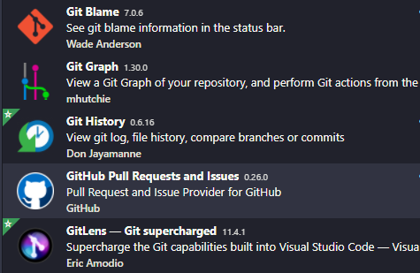

# WSL2搭建C/C++环境的记录

本文是在WSL2上搭建的记录，涉及的工具、环境等都是皮毛。

思路是WSL2上安装Ubuntu，通过VSCode将Git、CMake、GTest、GCov、LCOV、Doxygen、Cppcheck等连结起来进行开发、构建、验证。

# 安装WSL2

参考[Windows安装WSL2](https://blog.csdn.net/diy1982/article/details/116260306?spm=1001.2014.3001.5501)

# Ubuntu的使用

参考[WSL2(Ubuntu)使用小记](https://blog.csdn.net/diy1982/article/details/116497546?spm=1001.2014.3001.5501)

# 在Ubuntu上安装工具

Git安装

```shell
sudo apt install git
```

Git配置

```shell
git config --global user.name "xxx"

git config --global user.email "xxx@xxx.com"
```

CMake安装

```shell
sudo apt install cmake
```

GTest安装

参考[WLS2(Ubuntu)安装GTest](https://blog.csdn.net/diy1982/article/details/116310301?spm=1001.2014.3001.5501)

LCOV安装

```shell
sudo apt install lcov
```

Doxygen安装

```shell
sudo apt install doxygen
```

Cppcheck安装

```shell
sudo apt install cppcheck
```

gcc安装

```shell
sudo apt install gcc
```

gdb安装

```shell
sudo apt install gdb
```

工具安装好后，通过-v或--version来查看是否安装成功。

# VSCode的配置

VSCode在Windows上安装好后，通过安装安装插件来实现环境搭建的功能。

## 插件列表

| 分类            | 插件                                                         | 截图                                                         |
| --------------- | ------------------------------------------------------------ | ------------------------------------------------------------ |
| C/C++语言支持   | C/C++                                                        |                                       |
|                 | C++ Intellisense                                             |                |
| GTest           | C++ TestMate                                                 |                        |
| CMake支持       | CMake Tools<br/>CMake                                        |                                |
| Doxyge支持      | Doxygen Documentation generation                             |  |
| Git及GitHub支持 | Git Blame<br/>Git Graph<br/>Git History<br/>GitHub Pull Requests and Issues<br/>GitLens — Git supercharged |                                          |
| WSL2支持        | Remote - Containers<br/>Remote - SSH<br/>Remote - SSH: Editing Configuration Files<br/>Remote - WSL |                                          |
| python支持      | Pylance<br/>Python                                           |                                    |
| 代码风格支持    | Better C++ Syntax                                            |              |
|                 | Prettier - Code formatter                                    |  |
| 彩色括号显示    | Bracket Pair Colorizer 2                                     |  |
| 彩虹缩进显示    | indent-rainbow                                               |                    |
| 十六进制编辑    | Hex Editor                                                   |                            |
| 汇编支持        | x86 and x86_64 Assembly                                      |  |
| 图片支持        | Luna Paint                                                   |                            |
| Markdown        | markdownlint                                                 |                        |
| Jupyter支持     | Jupyter                                                      |                                  |
| Todo支持        | Todo Tree                                                    |                              |
| 主题和图标      | C/C++ Themes                                                 |                          |
| 主题和图标      | Dracula Official                                             |                |
| 主题和图标      | Fluent Icons                                                 |                        |
| 主题和图标      | Material Icon Theme                                          |          |
| 主题和图标      | Material Product Icons                                       |    |
| 主题和图标      | vscode-icons                                                 |                        |


## Doxygen片段的配置

在VSCode的settings.json增加Doxygen的修改。通过片段配置，在函数前或文件前输入`/**+回车`，就会补全Doxygen的注释，再进行针对性的修改就可以了。

```json
{
  // 文件注释：自定义模块

  "doxdocgen.file.customTag": [

​    "****************************************************************************",

​    //"@par 修改日志:",

​    // "<table>",

​    // "<tr><th>Date    <th>Version <th>Author <th>Description",

​    // "<tr><td>{date} <td>1.0   <td>{author}  <td>内容",

​    // "</table>",

  ],

  "doxdocgen.generic.authorEmail": "xxx@xxx.com",

  "doxdocgen.generic.authorName": "xxx",

  // 文件注释的组成及其排序

  "doxdocgen.file.fileOrder": [

​    "custom",

​    "file", // @file

​    "brief", // @brief 简介

​    "author", // 作者

​    "version", // 版本

​    "date", // 日期

​    "empty", // 空行

​    "copyright", // 版权

​    "custom" // 自定义

  ],

  // 下面时设置上面标签tag的具体信息

  "doxdocgen.file.fileTemplate": "@file{indent:10}{name}",

  "doxdocgen.file.versionTag": "@version 1.0",

  "doxdocgen.generic.authorTag": "@author  {author} ({email})",

  // 日期格式与模板

  "doxdocgen.generic.dateFormat": "YYYY-MM-DD",

  "doxdocgen.generic.dateTemplate": "@date{indent:10}{date}",

  "doxdocgen.generic.paramTemplate": "@param{indent:10}{param}{indent:20}说明",

  "doxdocgen.generic.returnTemplate": "@return{indent:10}{type} ",

  "doxdocgen.generic.splitCasingSmartText": true,

  "doxdocgen.generic.briefTemplate": "@brief{indent:10}{text}",

  // 根据自动生成的注释模板（目前主要体现在函数注释上）

  "doxdocgen.generic.order": [

​    "custom",

​    "brief",

​    "empty",

​    "tparam",

​    "param",

​    "return",

​    "custom"

  ],

  "doxdocgen.generic.customTags": [

​    "****************************************************************************"

  ],
}
```

# 示例工程

示例工程采用了静态库+GTest测试的方式来演示。包含了带子文件夹的静态库和不带子文件夹的静态库，分别为编译为两个静态库。测试用例编译为可执行文件。

静态库采用了C语言，GTest采用了C++。


# 遗留问题

目前的配置中，GCov针对静态库文件无法进行分析
